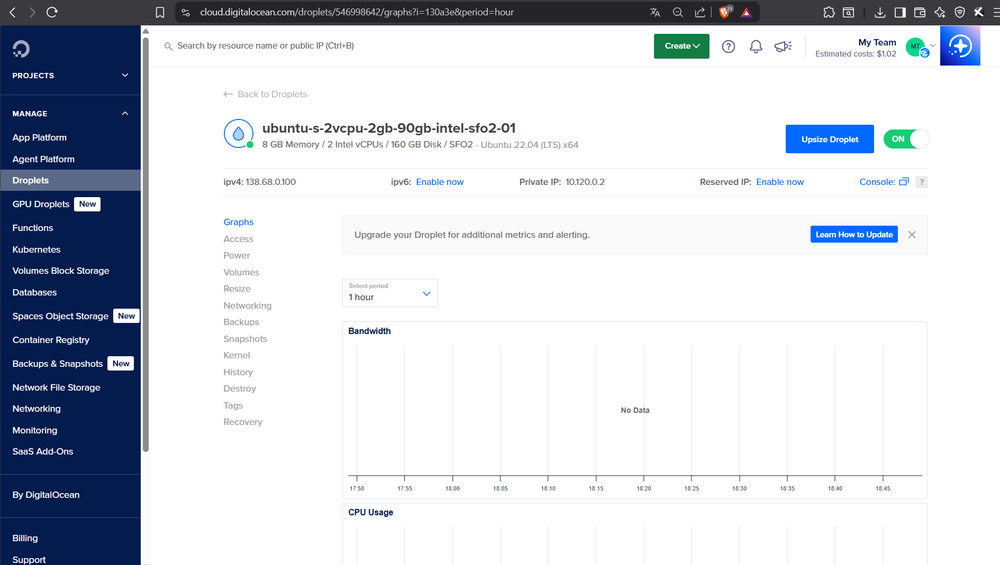
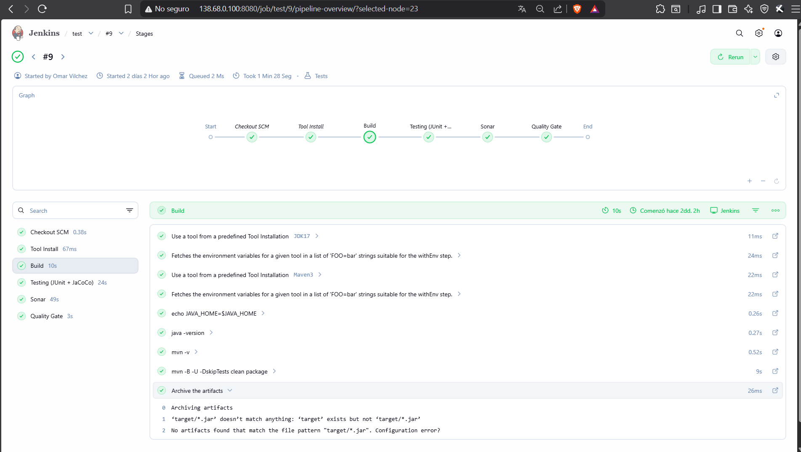
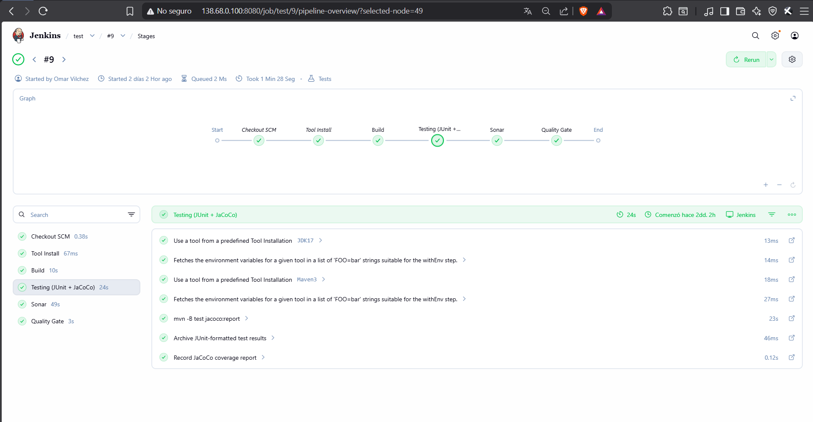
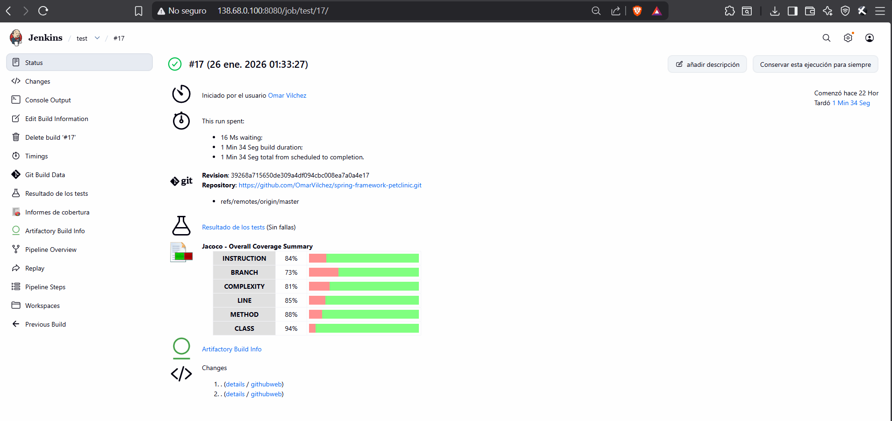
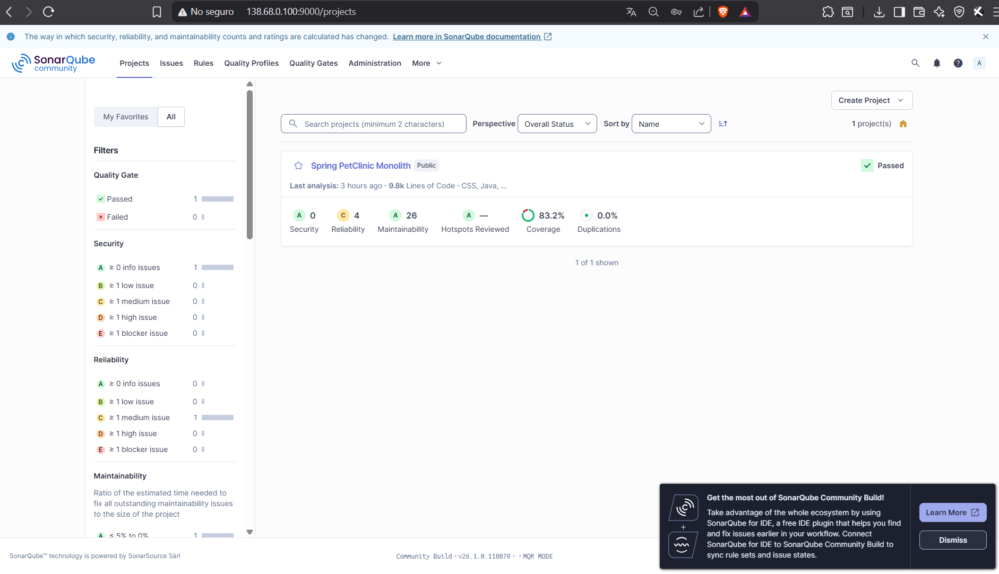
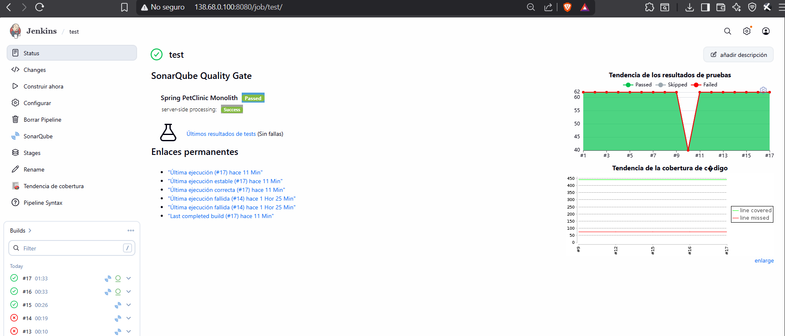
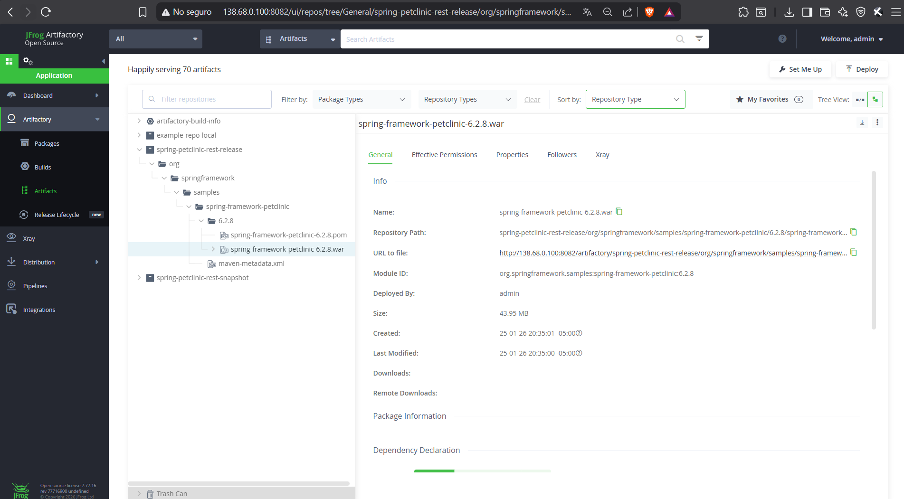

# CI/CD Pipeline – Spring PetClinic Monolith

Este proyecto implementa un pipeline de **Integración Continua y Entrega Continua (CI/CD)** para una aplicación **monolítica** basada en **Spring Framework PetClinic**, cumpliendo con los requerimientos del trabajo.

---

## Repositorio GitHub
https://github.com/OmarVilchez/spring-framework-petclinic

---

## Herramientas Utilizadas

- **GitHub** – Control de versiones y repositorio remoto
- **Jenkins** – Automatización del pipeline CI/CD  
  http://138.68.0.100:8080
- **SonarQube** – Análisis estático de código y Quality Gate  
  http://138.68.0.100:9000
- **JFrog Artifactory** – Gestión y almacenamiento de artefactos  
  http://138.68.0.100:8082
- **Maven** – Gestión de dependencias y build
- **Java 17**
- **JUnit & JaCoCo** – Testing y cobertura de código
- **Ubuntu 22.04 LTS** – Entorno de ejecución en DigitalOcean

---

## Pipeline Implementado

El pipeline fue implementado en Jenkins mediante un `Jenkinsfile` y contiene los siguientes stages:

1. **Build**  
   Compilación del proyecto y generación del artefacto **WAR**.

2. **Testing (JUnit + JaCoCo)**  
   Ejecución de pruebas unitarias y generación de reportes de cobertura de código.

3. **SonarQube**  
   Análisis estático de código y validación mediante **Quality Gate**.

4. **Publish Artifacts**  
   Publicación del artefacto en **JFrog Artifactory** siguiendo el layout estándar de Maven.

---

## Evidencias del Pipeline

### Infraestructura en DigitalOcean

---

### Build

---

### Testing(Junit + Jacoco)

---

### SonarQube – Proyecto Analizado

---

### SonarQube – Quality Gate Aprobado

---

### JFrog Artifactory – Artefacto Publicado

---
